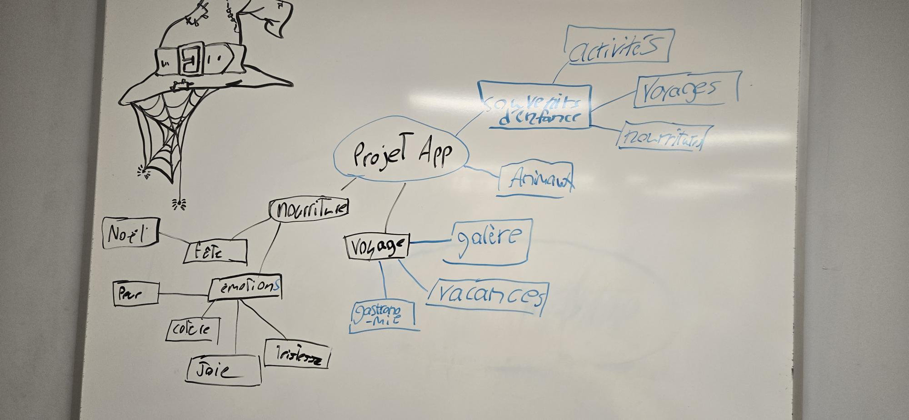

# Cahier de Charges: Mémoires interactives

## 📌 Informations du Projet

*Nom du projet:* Les 6 visions du monde
*Nom de l'équipe:* Les voyageurs
*Membres:*

- Radhouane - Chef de projet / Architecture
- Amira - Responsable du Design + Animations
- Thearylou - Données + Systèmes

*Date de début:* 8 octobre 2025<br>
*Date de livraison finale:* 10 décembre 2025<br>
*Version du document:* 1.0<br>


## 🎯 1. Présentation du Projet

[Autres variantes pour cette option A que le "musée" à proprement parler](./variantes_memoires.md){ md-button }

### 1.1 Concept général




Ce musée interactif est dédié au voyage, exploré sous toutes ses formes : détente, aventure, culture ou imprévus. À travers des récits authentiques et sensoriels, les visiteurs découvrent différentes manières de vivre un voyage, et les émotions qui y sont liées, avec comme fil conducteur l’émerveillement.

Au-delà de la découverte, l’expérience vise à susciter une réflexion personnelle. En s’immergeant dans les souvenirs des autres, chaque visiteur est invité à se reconnecter à ses propres expériences ou envies de voyage, transformant ainsi la visite en un voyage intérieur.


### 1.2 Public cible

- *Âge:* 18-60 ans
- *Profil:* Passionnés du voyage
- *Niveau technique:* Utilisateurs grand public avec peu de connaissances techniques

### 1.3 Objectifs du projet

- [x] Créer une expérience émotionnelle immersive
- [x] Permettre aux utilisateurs de sauvegarder et partager leurs mémoires
- [x] Démontrer la maîtrise de Vue.js, GSAP et Pinia
- [x] Créer une interface accessible et responsive
- [ ] [Autre objectif spécifique]


## 🏛️ 2. Architecture du Musée

### 2.1 Structure des salles

Listez toutes les salles de votre musée (minimum 4, idéal 6-8):

| # | Nom de la salle                        | Thème/Concept                                           | Couleur dominante         | Ambiance sonore                        |
|---|----------------------------------------|---------------------------------------------------------|---------------------------|----------------------------------------|
| 1 | Salle des Vacances & Évasions         | Voyages relaxants et amusants                           | Bleu turquoise (#40E0D0) | Bruits de vagues, chants d’oiseaux |
| 2 | Salle des Aventures                   | Expériences excitantes et inoubliables                  | Rouge orangé (#FF4500) | Musique rythmée, sons de nature sauvage |
| 3 | Salle des Explorations Urbaines       | Découverte des grandes villes et de leur culture        | Gris urbain (#A9A9A9) | Bruits de rue, conversations lointaines |
| 4 | Salle des Galères et Moments Drôles   | Les imprévus qui sont devenus des souvenirs mémorables  | Vert fluo (#39FF14) | Rires, effets sonores comiques |
| 5 | Salle de la Culture et de la Gastronomie | Expériences culinaires et culturelles marquantes     | Or (#FFD700) | Musique traditionnelle, sons de cuisine |
| 6 | Salle des Endroits Préférés           | Lieux que tu as adorés visiter ou où tu aimerais retourner | Bleu doux (#4682B4) | Sons de la nature ou ambiance locale |


### 2.2 Types de mémoires

Décrivez les types de mémoires que les utilisateurs peuvent créer:

- *Mémoire texte:* Titre + description + date + tags
- *Mémoire photo:* Image + légende + date + tags

### 2.3 Système de tags/catégories

Listez les tags prédéfinis et permettez les tags personnalisés:


**Tags prédéfinis :**

- Aventure  
- Détente  
- Culture  
- Famille  
- Amis  
- Rencontre  
- Premier voyage  
- Galère  
- Coup de cœur  
- Émerveillement  

**Tags personnalisés :** Oui ☑ / Non ☐


## 🎨 3. Design et Identité Visuelle

### 3.1 Moodboard

Insérez ici 3-5 images d'inspiration (ou liens):

- [Image 1: Style visuel général]
- [Image 2: Palette de couleurs]
- [Image 3: Typographie inspirante]
- [Image 4: Animations de référence]

### 3.2 Palette de couleurs

*Couleurs principales:*

- Primaire: [#XXXXXX] - Utilisée pour: [navigation, boutons principaux]
- Secondaire: [#XXXXXX] - Utilisée pour: [accents, hover states]
- Tertiaire: [#XXXXXX] - Utilisée pour: [backgrounds, cartes]

*Couleurs par salle:*

- Salle 1: [#XXXXXX]
- Salle 2: [#XXXXXX]
- [etc.]

*Couleurs système:*

- Succès: [#10B981]
- Erreur: [#EF4444]
- Warning: [#F59E0B]
- Info: [#3B82F6]

### 3.3 Typographie

- *Titres (H1-H2):* [Nom de la police] - [Lien Google Fonts]
- *Sous-titres (H3-H4):* [Nom de la police]
- *Corps de texte:* [Nom de la police]
- *Poids utilisés:* Regular (400), Medium (500), Bold (700)

### 3.4 Style visuel

Choisissez un ou plusieurs styles:
- [x] Minimaliste
- [ ] Vintage/Rétro
- [ ] Moderne/Futuriste
- [ ] Organique/Naturel
- [x] Ludique/Coloré
- [ ] Élégant/Sobre


## 💻 4. Spécifications Techniques

### 4.1 Stack technologique

*Frontend obligatoire:*

- ✅ Vue.js 3 (Composition API ☐ / Options API ☑)
- ✅ Vite
- ✅ Vue Router
- ✅ Pinia (state management)
- ✅ CSS
- ✅ GSAP + ScrollTrigger

*Librairies additionnelles envisagées:*

- [ ] VueUse (composables utilitaires)
- [x] Vuelidate (validation de formulaires)
- [x] Day.js (manipulation de dates)

### 4.2 Architecture des composants

Listez vos composants Vue principaux:

*Composants de layout:*

- `AppHeader.vue` - Navigation principale
- `AppFooter.vue` - Informations, crédits
- `Sidebar.vue` - Menu latéral des salles

*Composants de contenu:*

- `RoomView.vue` - Vue d'une salle individuelle
- `MemoryCard.vue` - Carte d'une mémoire
- `MemoryList.vue` - Liste/grille de mémoires
- `MemoryForm.vue` - Formulaire d'ajout/édition

*Composants UI:*

- `ButtonPrimary.vue` - Bouton principal
- `Modal.vue` - Fenêtre modale
- `LoadingSpinner.vue` - Indicateur de chargement
- `TagBadge.vue` - Badge de tag


### 4.3 Routes (Vue Router)

| Route | Composant | Description | Authentification requise? |
|-------|-----------|-------------|---------------------------|
| `/` | `HomeView.vue` | Page d'accueil/intro | Non |
| `/musee` | `MuseumView.vue` | Vue d'ensemble du musée | Oui |
| `/salle/:id` | `RoomView.vue` | Vue détaillée d'une salle | Oui |
| `/memoire/:id` | `MemoryDetailView.vue` | Détail d'une mémoire | Oui |
| `/recherche` | `SearchView.vue` | Recherche de mémoires | Oui |
| `/profil` | `ProfileView.vue` | Profil utilisateur | Oui |
| `/login` | `LoginView.vue` | Connexion | Non |

### 4.4 Gestion de l'état (Pinia)

*Stores prévus:*

1. *`useMuseumStore`*
   - State: `rooms`, `currentRoomId`, `museumName`, `theme`
   - Actions: `addRoom()`, `updateRoom()`, `deleteRoom()`, `setCurrentRoom()`

2. *`useMemoryStore`*
   - State: `memories`, `filters`, `searchQuery`
   - Actions: `addMemory()`, `updateMemory()`, `deleteMemory()`, `searchMemories()`
   - Getters: `filteredMemories`, `memoriesByRoom`, `memoriesByTag`

3. *`useAuthStore`* (optionnel)
   - State: `user`, `isAuthenticated`
   - Actions: `login()`, `logout()`, `register()`

### 4.5 Persistance des données

*Méthode choisie:*

- [x] LocalStorage (obligatoire pour MVP)
- [ ] Firebase Firestore: pour galerie publique et collaborative (optionnel pour équipes plus avancées)

*Structure de données LocalStorage:*

```json
{
  "museumName": "Mon Musée",
  "theme": "default",
  "createdAt": "2025-01-15T10:00:00Z",
  "rooms": [
    {
      "id": "room-1",
      "name": "Salle de l'enfance",
      "description": "Mes premiers souvenirs...",
      "theme": "childhood",
      "color": "#FFB6C1",
      "memories": [
        {
          "id": "mem-1",
          "title": "Mon premier vélo",
          "description": "Un vélo rouge que j'ai reçu à 6 ans...",
          "date": "1995-06-15",
          "image": "data:image/jpeg;base64,...",
          "tags": ["enfance", "cadeau", "famille"],
          "createdAt": "2025-01-15T10:30:00Z"
        }
      ]
    }
  ]
}
```


## 🎬 5. Fonctionnalités et User Stories

### 5.1 Fonctionnalités MVP (Minimum Viable Product)

*Obligatoires pour la livraison:*

- [ ] *F1 - Navigation entre salles*
  - L'utilisateur peut naviguer entre 4-6 salles différentes
  - Transitions animées avec GSAP
  - Menu de navigation visible

- [ ] *F2 - Affichage des mémoires*
  - Les mémoires s'affichent sous forme de cartes
  - Grille responsive (mobile + desktop)
  - Animation au scroll (ScrollTrigger)

- [ ] *F3 - Ajout de mémoire*
  - Formulaire avec titre, description, date, tags
  - Upload d'image (base64 ou URL)
  - Validation des champs obligatoires

- [ ] *F4 - Édition de mémoire*
  - Modifier les informations d'une mémoire existante
  - Sauvegarde instantanée

- [ ] *F5 - Suppression de mémoire*
  - Confirmation avant suppression
  - Suppression permanente

- [ ] *F6 - Filtres et recherche*
  - Recherche par mot-clé (titre/description)
  - Filtrage par tags
  - Filtrage par salle

- [ ] *F7 - Sauvegarde locale*
  - Auto-save dans LocalStorage après chaque action
  - Chargement automatique au démarrage
  - Export en fichier JSON

- [ ] *F8 - Import de données*
  - Importer un fichier JSON de musée
  - Validation du format

- [ ] *F9 - Responsive*
  - Mobile (320px+)
  - Tablette (768px+)
  - Desktop (1024px+)

- [ ] *F10 - Accessibilité*
  - Navigation au clavier
  - ARIA labels
  - Contraste WCAG AA

### 5.2 Fonctionnalités bonus (optionnelles)

- [ ] *B1 - Authentification simple*
  - Login avec email/password
  - Multi-utilisateurs (localStorage séparé par user)

- [ ] *B2 - Sons d'ambiance*
  - Son différent par salle
  - Contrôle volume
  - Mute toggle

- [ ] *B3 - Timeline chronologique*
  - Vue chronologique des mémoires
  - Tri par date

- [ ] *B4 - Mode sombre*
  - Toggle dark/light mode
  - Sauvegarde de la préférence

- [ ] *B5 - Partage social*
  - Génération de lien de partage
  - Aperçu Open Graph

- [ ] *B6 - Firebase (équipes avancées)*
  - Synchronisation cloud
  - Galerie publique
  - Multi-device

### 5.3 User Stories

*Format:* En tant que [rôle], je veux [action] afin de [bénéfice]

1. *US-01:* En tant qu'utilisateur, je veux créer mon musée personnel afin de préserver mes souvenirs importants.

2. *US-02:* En tant qu'utilisateur, je veux organiser mes mémoires en salles thématiques afin de les retrouver facilement.

3. *US-03:* En tant qu'utilisateur, je veux ajouter des photos à mes mémoires afin de les rendre plus vivantes.

4. *US-04:* En tant qu'utilisateur, je veux taguer mes mémoires afin de les catégoriser et les filtrer.

5. *US-05:* En tant qu'utilisateur, je veux rechercher dans mes mémoires afin de retrouver un souvenir spécifique rapidement.

6. *US-06:* En tant qu'utilisateur, je veux que mes données soient sauvegardées automatiquement afin de ne jamais perdre mes souvenirs.

7. *US-07:* En tant qu'utilisateur, je veux pouvoir exporter mon musée afin de le sauvegarder ou le partager.

8. *US-08:* En tant qu'utilisateur mobile, je veux accéder à mon musée sur mon téléphone afin de consulter mes souvenirs partout.

9. [Ajoutez vos user stories]


## 🎨 6. Maquettes et Wireframes

### 6.1 Lien vers les maquettes Figma

*Lien:* [Insérez votre lien Figma]

### 6.2 Écrans principaux à maquetter

- [ ] Page d'accueil / Landing
- [ ] Vue d'ensemble du musée (toutes les salles)
- [ ] Vue détaillée d'une salle (grille de mémoires)
- [ ] Détail d'une mémoire (modal ou page dédiée)
- [ ] Formulaire d'ajout/édition de mémoire
- [ ] Page de recherche/filtres
- [ ] Page profil utilisateur (optionnel)
- [ ] Version mobile de 2-3 écrans clés

### 6.3 Interactions clés à maquetter

- Transition entre salles (animation)
- Ouverture d'une carte mémoire (modal/expansion)
- Survol sur les éléments interactifs
- États des formulaires (vide, rempli, erreur, succès)


## 📊 7. Plan de Réalisation

### 7.1 Répartition des rôles

| Membre | Rôle principal | Responsabilités |
|--------|----------------|-----------------|
| Radhouane | Chef de projet + Architecture Vue | Coordination, Vue Router, stores Pinia, structure des composants |
| Thearylou | Design + Animations | CSS, design visuel, animations GSAP, transitions |
| Amira | Données + Validation | LocalStorage/Firebase, validation formulaires, gestion erreurs |

*Note:* Tous participent au développement, mais chacun a sa spécialité.

### 7.2 Tâches transversales

*À répartir entre tous:*

- Développement des composants
- Tests et debugging
- Documentation du code
- Présentation finale

### 7.3 Outils de collaboration

- *Git/GitHub:* https://github.com/Rad8433/projet-integrateur-web
- *Gestion de projet:* [Trello]
- *Communication:* [Teams]
- *Design:* [Figma]
- *Documentation:* [README.md]


## 🚀 8. Critères de Succès

### 8.1 Critères techniques

- [ ] Application Vue.js fonctionnelle sans erreurs console
- [ ] Minimum 8 composants Vue bien structurés
- [ ] Vue Router avec 5+ routes
- [ ] Pinia implémenté avec state management cohérent
- [ ] CSS organisé avec variables et mixins
- [ ] Animations GSAP fluides (60 FPS)
- [ ] Données persistantes (LocalStorage)
- [ ] Code validé (ESLint)
- [ ] Responsive sur 3 breakpoints
- [ ] Accessibilité WCAG AA

### 8.2 Critères de qualité

- [ ] Interface intuitive et facile à utiliser
- [ ] Design cohérent et esthétique
- [ ] Animations pertinentes (pas excessives)
- [ ] Temps de chargement < 2 secondes
- [ ] Aucun bug bloquant
- [ ] Messages d'erreur clairs
- [ ] Documentation complète (README)

### 8.3 Critères créatifs

- [ ] Concept original et personnel
- [ ] Expérience utilisateur émotionnelle
- [ ] Attention aux détails visuels
- [ ] Cohérence thématique


## 📅 9. Calendrier du projet: Planning prévisionnel

### 9.1 *PHASE 1: PLANIFICATION ET DESIGN*
<!--Semaine 1-2 (la 2 étant la semaine de rattrapage)-->

**Du 8 au 22 octobre**

*Remise 22 octobre | 15%*

- Rédaction du cahier de charges
- Création des maquettes Figma
- Définition de l'architecture technique
- Setup du projet (Vite + Vue + dépendances)

### 9.2 *PHASE 2: FONDATION*
<!--Semaine 3-4-->

**Du 22 octobre au 2 novembre environ**

*Remise Phases 2 FONDATION et 3 INTERACTIVITÉ : vendredi 14 novembre | 15%*

!!! tip "Le projet portfolio en parallèle"
    Notez que mercredi le 29 octobre c'est la remise et présentation de votre portfolio donc nous laissons un peu plus qu'une semaine pour cette phase car vous allez probablement finaliser votre portfolio en même temps.

- Structure des composants de base
- Vue Router configuré
- Pinia stores créés
- Premiers composants (Header, RoomCard, etc.)


### 9.3 *PHASE 3: INTERACTIVITÉ*
<!-- Semaine 4-5-->

**Environ du 2 novembre au 12 novembre**

*Remise Phases 2 FONDATION et 3 INTERACTIVITÉ : vendredi 14 novembre | 15%*

- Formulaires d'ajout/édition
- CRUD des mémoires (CRUD: Create, Read, Update, Delete)
- Filtres et recherche
- Validation des données

### 9.4 *PHASE 4: ANIMATIONS ET MÉDIAS*
<!-- Semaine 6 -->

**Du 12 au 19 novembre**

*Remise Phases 4 ANIMATIONS+MÉDIAS et 5 PERSISTANCE : 26 novembre | Formatif*

- Intégration GSAP
- Transitions entre pages
- Upload et gestion d'images
- Sons d'ambiance (optionnel)


### 9.x *ÉVALUATION PAR LES PAIRS ET AUTO-ÉVALUATION DE MI PARCOURS*

**Sera fait en classe le 19 novembre**

*Remise de l'évaluation par les pairs et auto-évaluation de mi parcours: 19 novembre | 5%*


### 9.5 *PHASE 5: PERSISTANCE ET SAUVEGARDE DES DONNÉES*
<!-- Semaine 7 -->

**Du 19 au 26 novembre**

*Remise Phases 4 ANIMATIONS+MÉDIAS et 5 PERSISTANCE : 26 novembre | Formatif*

- LocalStorage complet
- Import/Export JSON
- Gestion des erreurs
- Firebase (optionnel)

### 9.6 *PHASE 6: AFFINAGE ET ACCESSIBLITÉ* pour la version *BETA*

*Du 26 novembre au 3 décembre*

> Remise version *BETA* le 3 décembre | Formatif

- Responsive final
- Accessibilité (ARIA, keyboard)

### 9.7 *PHASE 7:  CONTRÔLE QUALITÉ ET CORRECTIONS*
<!-- Semaine 8 -->
**Du 3 au 8 décembre**

*Remise Phase 7 RAPPORT DU CONTRÔLE DE LA QUALITÉ : 8 décembre | 10%*

- Tests de toutes les branches de l'histoire
- Tests fonctionnels
- Tests multi-plateformes (navigateurs et appareils)
- Relecture et corrections
- Optimisation de la performance
- Gestion des bogues

### 9.8 *PHASE 8:  FINALISATION*
<!-- Semaine 8 + 2 jours-->

**Du 3 au 10 décembre** (peut-être fait en parallèle avec la phase 7)

*Remise et présentation finale : 10 décembre | 50%*

- Documentation (README complet)
- Déploiement - Mise en ligne (GitHub/Netlify/Vercel)
- Vidéo de présentation
- Préparation de la démo en classe

### 9.9 *PHASE 9: POST-MORTEM*

**Du 10 au 12 décembre**

*Remise de l'analyse réflexive et suivi de l'évaluation de mi-parcours: 12 décembre | 5%*

## 🎯 10. Risques et Solutions

| Risque | Probabilité | Impact | Solution préventive |
|--------|-------------|--------|---------------------|
| Manque de temps pour toutes les features | Élevée | Moyen | Prioriser le MVP, features bonus séparées |
| Problèmes de merge Git | Moyenne | Élevé | Branches claires, pull requests, communication |
| Upload d'images trop lourdes | Moyenne | Moyen | Validation taille, compression, limite 2MB |
| Animations qui lag | Faible | Moyen | Tests de performance réguliers, optimisation GSAP |
| Perte de données LocalStorage | Faible | Élevé | Export JSON régulier, backups manuels |
| Désaccord sur le design | Moyenne | Faible | Vote d'équipe, décision du chef de projet |


## 📝 11. Annexes

### 11.1 Ressources et références

*Documentation officielle:*

- Contenu du cours Web 5 https://tim-montmorency.com/compendium/582-511-web5/
- Guide étudiant du projet appli web créative: https://tim-montmorency.com/compendium/582-511-web5/projets/appweb-creative/syllabus_guide_etudiant.html
- Vue.js: https://vuejs.org
- Pinia: https://pinia.vuejs.org
- GSAP: https://greensock.com/docs/
- SASS: https://sass-lang.com/documentation

*Tutoriels utiles:*

- [Lien vers tuto 1]
- [Lien vers tuto 2]

*Inspirations:*

- [Site 1]
- [Site 2]

### 11.2 Glossaire

- *Composant:* Élément Vue.js réutilisable
- *Store:* Gestion d'état centralisée avec Pinia
- *Route:* URL de navigation dans l'application
- *Props:* Données passées d'un composant parent à enfant
- *Emit:* Événement émis d'un composant enfant vers parent


## ✅ Validation du Cahier de Charges

*Date de validation:* [Date]

*Signatures:*

- Chef de projet: _______________
- Membre 2: _______________
- Membre 3: _______________
- Membre 4: _______________ (si applicable)

*Validation enseignant:* _______________  
*Date:* _______________  
*Commentaires:*

---

*Version du document cahier de charge:* 1.0  
*Dernière mise à jour:* [Écrire ici la date]
