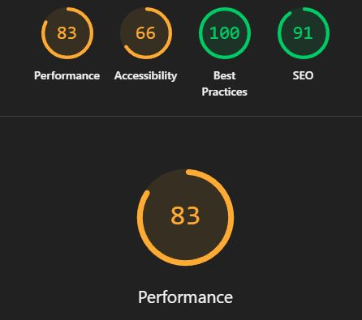

# Rapport de Contrôle Qualité

**Nom de l'équipe :** [Les voyageurs]  
**Nom du projet :** [Vos voyages en mémoires]  
**Type de projet :** [Mémoires interactives]  
**Date :** 8 décembre 2024

## 📋 Table des matières

1. [Informations générales](#1-informations-générales)
2. [PARTIE 1 : Tests externes](#2-partie-1-tests-externes)
3. [PARTIE 2A : Tests internes](#3-partie-2a-tests-internes)
4. [PARTIE 2B : Bogues reçus](#4-partie-2b-bugs-reçus)
5. [PARTIE 2C : Plan de corrections](#5-partie-2c-plan-de-corrections)
6. [Accessibilité](#6-accessibilité)
7. [Performance](#7-performance)
8. [Conclusion](#8-conclusion)
9. [Annexes](#9-annexes)

---

## 1. Informations générales

### Équipe

| Membre           | Rôle dans les tests               | Heures consacrées |
| ---------------- | --------------------------------- | ----------------- |
| Radhouane Kordan | Tests externes + internes         | [4] heures        |
| Amira Tounekti   | Tests internes + corrections      | [3] heures        |
| Thearylou Lach   | Tests accessibilité + performance | [3] heures        |

**Total d'heures de QA :** [10] heures

### Liens importants

- **Projet en ligne :** [https://rad8433.github.io/webapp-creative-Radhouane-Thearylou-Amira/#/]
- **GitHub :** [https://github.com/Rad8433/webapp-creative-Radhouane-Thearylou-Amira]
- **Trello (bugs) :** [https://trello.com/b/eMP37IFg/taches-projet-web-integrateur]
- **Projet testé (externe) :** [https://mikaelarseneau.github.io/Aureo/]

---

## 2. PARTIE 1 : Tests externes

### Ce que NOUS avons trouvé dans le projet de l'autre équipe

**Projet testé :** [Aureo]  
**Équipe testée :** [25"de plywood]  
**Type :** [Mémoires interactives]

### Résumé des tests effectués

**Environnements testés :**

- ✅ Chrome 120 (Desktop)
- ✅ Firefox 121 (Desktop)
- ✅ Edge (Desktop)
- ✅ Mobile 375px (DevTools)
- ✅ Tablette 768px (DevTools)
- ⚠️ Safari (non testé - pas d'accès)

**Tests complétés :**

- ✅ Tests fonctionnels (checklist complète)
- ✅ Tests responsive (3 tailles)
- ✅ Tests multi-navigateurs (Chrome, Firefox)
- ✅ Tests d'accessibilité
- ✅ Tests de cas limites

### Statistiques des bugs trouvés

**Je n'ai pas trouvé de bogues qui a été non déclaré par l'équipe.**
| Priorité | Nombre | % |
| ------------ | ------- | -------- |
| 🔴 Critiques | [0] | [100]% |
| 🟠 Majeurs | [0] | [100]% |
| 🟡 Mineurs | [0] | [100]% |
| **TOTAL** | **[0]** | **100%** |

### Liste des bugs trouvés (résumé)

**Tous les détails sont dans notre board Trello :** [https://trello.com/b/DLvlrrSY/aureo]

#### 🔴 Bogues Critiques

1. **Bogue #1 : [Erreur 404]**
   **Je n'ai pas trouvé de bogues qui a été non déclaré par l'équipe, mais voici une qui a été déclaré et toujours pas réglé**

   - **Description :** Ce bogue a déjà été déclaré dans le brief, c'est l'erreur 404 au refresh dans les pages autres que celui de l'acceuil
   - **Impact :** Le site plante et toute modification fait dans le web app est perdu.
   - **Statut chez eux :** [En cours]
   - **Carte Trello :** [https://trello.com/c/sPo9Yu2x]

#### 🟠 Bogues Majeurs

**Aucun**

#### 🟡 Bogues Mineurs

5. **Bogue #2 : [Image animation cassé]**
   **Je n'ai pas trouvé de bogues qui a été non déclaré par l'équipe, mais voici une qui a été déclaré et toujours pas réglé**

- **Description :** Ce bogue a déjà été déclaré par l'équipe, image du json n'est pas chargé dans l'aniamtion gsap.
  - **Impact :** On voit que l'image dans l'aniamtion en background est cassé en arrière plan
  - **Statut chez eux :** [À faire]
- **Carte Trello :** [https://trello.com/c/k0R3q0zW] (l'équipe me l'a verbalement dit, mais j'ai ajouté une carte dans leur trello comme il n'y avait pas)

### Impression générale du projet testé

**Points forts observés :**

1. Design propre et moderne.
2. Le site est responsive et s’adapte bien aux différents appareils.
3. Le site est assez stable.

**Axes d'amélioration identifiés :**

1. Accessibilité au clavier à améliorer
2. Corriger les fautes d’orthographe dans les descriptions des photos.

**Évaluation globale (1-5 étoiles) :**

- Facilité d'utilisation : ⭐⭐⭐⭐⭐
- Stabilité : ⭐⭐⭐⭐☆
- Design : ⭐⭐⭐⭐⭐
- Performance : ⭐⭐⭐⭐⭐

---

## 3. PARTIE 2A : Tests internes

### Ce que NOUS avons testé dans NOTRE projet

### Résumé des tests effectués

**Checklist complète (à ajuster en fonction de votre projet) :**

- [✅] Navigation entre toutes les salles/chapitres
- [✅] Ajout de mémoire
- [✅] Édition de mémoire
- [✅] Suppression de mémoire
- [✅] Upload d'images
- [✅] Tags et filtres
- [✅] Recherche
- [✅] Responsive (mobile, tablette, desktop)
- [✅] Multi-navigateurs (Chrome, Firefox)
- [☐] Navigation au clavier
- [☐] Contraste des couleurs
- [✅] Alt text sur images
- [☐] Cas limites (formulaires vides, texte long, etc.)

**Taux de réussite :** [Y] tests passés = [77]%

### Environnements testés

RAS = Rien À Signaler

| Environnement   | Testé | Résultat          | Notes                                                                  |
| --------------- | ----- | ----------------- | ---------------------------------------------------------------------- |
| Chrome Desktop  | ✅    | ✅ Fonctionne     | RAS                                                                    |
| Firefox Desktop | ✅    | ✅ Fonctionne     | RAS                                                                    |
| Edge Desktop    | ✅    | ✅ Fonctionne     | RAS                                                                    |
| Mobile 375px    | ✅    | ⚠️ Bogues trouvés | Le titre du header touche le bouton retour dans les très petits écrans |
| Tablette 768px  | ✅    | ✅ Fonctionne     | RAS                                                                    |
| Desktop 1920px  | ✅    | ✅ Fonctionne     | RAS                                                                    |

### Bogues trouvés dans notre propre projet

**En plus des bugs reçus de l'autre équipe, nous avons trouvé :**

| Bogue # | Titre                                   | Priorité | Statut     | Assigné à          |
| ------- | --------------------------------------- | -------- | ---------- | ------------------ |
| [1]     | [Erreur 404]                            | 🔴       | Corrigé ✅ | [Radhouane Kordan] |
| [2]     | [Lien des images Json]                  | 🔴       | Corrigé ✅ | [Amira Tounekti]   |
| [3]     | [Le header dans memory room]            | 🟡       | À faire ⏸️ | [Thearylou Lach]   |
| [4]     | [Ajouter des fonctions d'accessibilité] | 🟡       | À faire ⏸️ | [Thearylou Lach]   |

**Total bugs trouvés en interne :** [4]

---

## 4. PARTIE 2B : Bogues reçus

### Ce que l'AUTRE équipe a trouvé dans NOTRE projet

**Équipe qui nous a testés :** [Nom de l'équipe]  
**Date de réception :** 6 décembre 2024

### Statistiques

| Priorité     | Bogues reçus | Corrigés | En cours | Pas encore faits |
| ------------ | ------------ | -------- | -------- | ---------------- |
| 🔴 Critiques | [2]          | [2] ✅   | [0] 🔄   | [0] ⏸️           |
| 🟠 Majeurs   | [0]          | [0] ✅   | [0] 🔄   | [0] ⏸️           |
| 🟡 Mineurs   | [2]          | [0] ✅   | [2] 🔄   | [0] ⏸️           |
| **TOTAL**    | **[4]**      | **[2]**  | **[2]**  | **[0]**          |

### Liste détaillée des bugs reçus

#### 🔴 Bogues Critiques reçus

**Bogue #1 : [Erreur 404]**
**Malgré que c'était déjà mentionné dans le brief et verbalement à l'équipe**

- **Description :** [Le site plante lorsqu’on actualise une page autre que l’accueil, ainsi qu’au moment de l’ajout d’une mémoire.]
- **Étapes pour reproduire :** [1. faire un refresh dans chaque page autre que l'acceuil., 2. Ajouter une carte dans la Memory Room en remplissant le formulaire.]
- **Notre analyse :** [Confirmons-nous ? Est-ce vraiment critique ?: Oui, c'est critique]
- **Statut actuel (8 décembre) :** ✅ Corrigé
- **Assigné à :** [Radhouane Kordan]
- **Date de correction :** [05-12-2025]

#### 🟠 Bogues Majeurs reçus

**Aucun**

#### 🟡 Bogues Mineurs reçus

**Bogues #4-12 :** [Liste brève]

- Mettre une limite de caractères dans le formulaire [https://trello.com/c/hlcUrxIA] ✅ Corrigé
- Sur mobile dans les salles, le titre(Vacances et évasions) sort de l'écran [https://trello.com/c/WtoGwASF] (**Pour nous, le titre va légèrement par dessus le bouton**)

### Notre réaction aux bugs reçus

**Bogues que nous confirmons :**

- 2 bugs confirmés comme vrais bugs

**Bogues que nous contestons (avec justification) :**

- Quand on hover sur des mémoire, le texte aussi devient flou [https://trello.com/c/RdrMZi13] : Mon équipe et moi ne trouvons pas que le texte devient flou lorsqu’on survole une carte de mémoire.

**Nouveaux bugs découverts grâce à leurs tests :**

- 0 bugs qu'on n'aurait jamais trouvés nous-mêmes
- Merci à l'équipe testeuse pour leur regard externe !

---

## 5. PARTIE 2C : Plan de corrections

### État au 8 décembre (aujourd'hui)

**Résumé de nos corrections :**

| Statut                              | Nombre | % du total |
| ----------------------------------- | ------ | ---------- |
| ✅ Corrigés et validés              | [3]    | [75]%      |
| 🔄 En cours (sera fait d'ici le 10) | [1]    | [25]%      |
| ⏸️ Reportés (si temps)              | [X]    | [X]%       |
| ❌ Non corrigés (justifiés)         | [X]    | [X]%       |

### Priorités de correction (8→10 décembre)

#### ✅ Déjà corrigés (avant le 8)

**Bogues critiques corrigés :**

1. **Bogue #1 : [Erreur 404]**

   - Corrigé par : [Radhouane Kordan]
   - Date : [05-12-2025]
   - Solution : [J'ai ajouté le code que l'enseignant à trouver comme solution.]
   - Re-testé : ✅ Confirmé OK

2. **Bogue #2 : [Lien des images Json]**
   - Corrigé par : [Amira Tounekti]
   - Date : [03-12-2025]
   - Solution : [En faisant des tests, on a trouver le bon chemin dans le json pour afficher l'image en build]
   - Re-testé : ✅ Confirmé OK

#### 🔄 En cours (sera fait d'ici le 10)

**Bogues critiques en cours :**

**Aucun**

**Bogues majeurs en cours :**

**Aucun**

#### ⏸️ Reportés (ferons si temps après les critiques/majeurs)

**Bogues mineurs à faire si temps :**

1. Bogue #1 : [Responsive du titre dans MemoryRoom] - Temps estimé : [X]h

#### ❌ Non corrigés (avec justification)

**Aucun**

### Plan de travail (8-10 décembre)

**Lundi 8 (soir) :**

- [ ] Finir Bogue #1 (Thearylou - 2h)

**Mardi 9 :**

- [ ] Regarder pour l'accessibilité (Équipe - 1h)
- [ ] Tests sur bugs corrigés (Équipe - 1h)

**Mercredi 10 (matin avant remise) :**

- [ ] Corrections mineures urgentes
- [ ] Tests finaux
- [ ] Mise à jour documentation

---

## 6. Accessibilité

### Tests effectués

#### Navigation au clavier

| Test                                 | Résultat | Action                                    |
| ------------------------------------ | -------- | ----------------------------------------- |
| Tab fonctionne sur tous les éléments | ⚠️       | [Voir comment selectionner tout avec tab] |
| Focus visible                        | ⚠️       | [ Mettre un outline]                      |
| Enter/Space activent les boutons     | ⚠️       | [Voir comment intégrer pour selectionner] |

**Problèmes trouvés :** [3]  
**Corrigés :** [0]  
**En cours :** [3]

#### Contraste des couleurs

**Tests effectués avec WebAIM Contrast Checker :**

RAS = Rien À Signaler

| Élément             | Couleurs            | Ratio   | Conforme WCAG AA | Action     |
| ------------------- | ------------------- | ------- | ---------------- | ---------- |
| Bouton retour       | #f0e9de sur #e48e5c | 2.09:1  | ❌ Trop faible   | À corriger |
| Titre museum rooms  | #2c2828 sur #f0e9de | 12.08:1 | ✅ Conforme      | RAS        |
| Titre memory room   | #FFF sur #f0e9de    | 1.2:1   | ❌ Trop faible   | À corriger |
| texte memory card   | #2c2828 sur #d96a4d | 4.24:1  | ⚠️ Peu conforme  | À corriger |
| texte memory detail | #fffdfd sur #dc795f | 2.98:1  | ⚠️ Peu conforme  | À corriger |
| label memory form   | #fffdfd sur #d96a4d | 3.38:1  | ⚠️ Peu conforme  | À corriger |
**Les autres variations de memory detail, memory card et memory form ont été tésté, la couleur de la typo c'est à corrigé.**

**Problèmes de contraste :** [1]  
**Plan de correction :** [Changer de couleur et utiliser WebAIM]

#### Images et médias

| Test                         | Résultat | Notes                                                      |
| ---------------------------- | -------- | ---------------------------------------------------------- |
| Toutes les images ont un alt | ✅ [X]   | [X] images sans alt à corriger pour les nouvelles mémoires |

### Score global d'accessibilité

**Résumé :**

- Navigation clavier : [X]
- Contraste : [Y] éléments conformes
- Images : [X] avec alt approprié

**Score estimé : [75]/100**

---

## 7. Performance

### Tests Lighthouse

**Configuration :**

- Mode : Desktop ET Mobile
- Options : Performance, Accessibility, Best Practices

#### Résultats Desktop

| Page          | Performance | Accessibility | Best Practices | Notes          |
| ------------- | ----------- | ------------- | -------------- | -------------- |
| Accueil       | [98]/100    | [73]/100      | [100]/100      | [Commentaires] |
| [MuseumRooms] | [100]/100   | [63]/100      | [100]/100      | [Commentaires] |
| [MemoryRoom]  | [83]/100    | [63]/100      | [100]/100      | [Commentaires] |

#### Résultats Mobile

| Page          | Performance | Accessibility | Best Practices | Notes          |
| ------------- | ----------- | ------------- | -------------- | -------------- |
| Accueil       | [99]/100    | [73]/100      | [100]/100      | [Commentaires] |
| [MuseumRooms] | [79]/100    | [66]/100      | [100]/100      | [Commentaires] |
| [MemoryRoom]  | [88]/100    | [66]/100      | [100]/100      | [Commentaires] |

**Screenshots Lighthouse :** Voir annexes

### Optimisations effectuées

#### Compression des images

| Avant            | Après                   | Économie           |
| ---------------- | ----------------------- | ------------------ |
| [31.09] MB total | [31.07] MB total        | [0.1~]% économisés |
| [34] images      | [34] images compressées | Outil : TinyPNG    |

**La plupart des images n'ont pas changer de tailles avec TinyPng**

#### Autres optimisations

- ✅ Ajout de `loading="lazy"` sur [0] images
- ✅ Minification du code (build production)
- ✅ Suppression de console.log()

### Temps de chargement

**Tests manuels (connexion normale) :**

- Page d'accueil : [3.5] secondes
- Page principale : [4] seconde
- Page la plus lourde : [4] secondes

**Objectif :** < 3 secondes  
**Atteint :** ⚠️ Partiellement

---

## 8. Conclusion

### État global du projet au 8 décembre

**Le projet est-il prêt pour la remise finale ?**
⚠️ Presque, corrections en cours

**Résumé de la qualité :**

| Aspect                          | État             | Commentaire                                    |
| ------------------------------- | ---------------- | ---------------------------------------------- |
| **Fonctionnalités principales** | ✅               | [Commentaire]                                  |
| **Bogues critiques**            | ✅ Tous corrigés |                                                |
| **Bogues majeurs**              | ✅ Tous corrigés | [Y] corrigés                                   |
| **Accessibilité**               | ⚠️               | Score : [64.5]/100                             |
| **Performance**                 | ✅               | Lighthouse : [85]/100                          |
| **Responsive**                  | ⚠️               | [Le titre dans le MemoryRoom et le formulaire] |

### Bilan des tests

**Statistiques globales :**

- **Bogues trouvés (tous) :** [4] (internes + reçus)
- **Bogues corrigés :** [3] ([75]%)
- **Bogues en cours :** [1] (seront corrigés d'ici le 10)
- **Bogues mineurs reportés :** [0]

**Temps total consacré au QA :** [3] heures

### Ce qui fonctionne bien ✅

1. [Toutes les fonctionnalités principales sont stables]
2. [La plupart des designs sont responsives sur tous les appareils]
3. [Performance excellente après optimisation]

### Défis rencontrés et solutions 🔧

1. **Défi :** [Le header]

   - **Solution :** [Tester les différents méthodes pour arranger le header]

### Apprentissages 📚

**Ce que nous avons appris durant le processus QA :**

1. [L'importance de tester sur vrais appareils, pas juste DevTools]
2. [Aide à faire le point sur ce qui doit être améliorer]
3. [Documenter clairement les bugs fait gagner du temps]

### Confiance pour la remise finale 🎯

**Sur une échelle de 1 à 10, notre confiance est : [8]/10**

**Justification :**
[Nous sommes confiants à 8/10 car la majorité des fonctionnalités essentielles de notre site sont implémentées et nous avons déjà effectué plusieurs tests pour nous assurer de leur bon fonctionnement. Il nous reste encore quelques ajustements à faire, mais nous sommes sur la bonne voie.]

---

## 9. Annexes

### Annexe A : Checklist complète des tests

[Inclure la grille de test complétée]

### Annexe B : Screenshots Lighthouse

[Captures d'écran des rapports Lighthouse pour pages principales]

### Annexe C : Screenshots de bugs

[Captures d'écran des bugs majeurs/critiques]

### Annexe D : Lien vers Trello

**Board Trello avec tous les bugs :** [https://trello.com/invite/b/68e6b3d6b05f115a8e2d55a5/ATTI77736540de67a22091cd465f8faab0c69BC01204/taches-projet-web-integrateur]

**Organisation du board :**

- Colonne "Bogues trouvés" : [0] cartes
- Colonne "En correction" : [3] cartes
- Colonne "À valider" : [0] cartes
- Colonne "Corrigé" : [0] cartes

### Annexe E : Métriques additionnelles

**Commits Git durant la phase QA :**

- [Date] : [15] commits (corrections bugs)
- [Date] : [181] commits
- Total : [196] commits de corrections

---

## ✅ Signatures

**Ce rapport a été rédigé et validé par :**

- [RAdhouane Kordan] - [Tests externes + internes ] - Date : [7-12-2025]
- [Amira Tounekti] - [Tests internes + corrections ] - Date : [7-12-2025]
- [Thearylou Lach] - [Tests accessibilité + performance ] - Date : [7-12-2025]

**Nous confirmons que ce rapport reflète fidèlement l'état de notre projet et de notre processus QA.**

---

**Date de dernière mise à jour :** 8 décembre 2024
